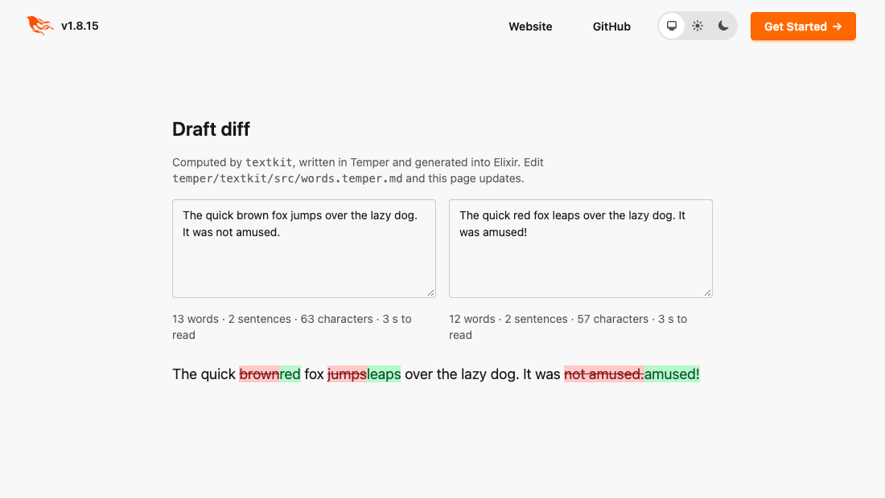

# Temper on the BEAM: an example

A Phoenix LiveView app whose text logic is written in [Temper](https://github.com/temperlang/temper)
and generated into Elixir by **be-elixir**, Temper's backend for Elixir and the BEAM.
Type two versions of a draft and see what changed between them. The diff and the
word counts are Temper code, running as Elixir.

Everything runs in Docker. The host needs Docker and `make`, nothing else.

```bash
make up          # builds the toolchain the first time (~10 min), then the app on http://localhost:4000
```



## Change the Temper, watch the app change

`make up` runs two services:

| service  | what it does |
|----------|--------------|
| `temper` | watches `temper/` and rebuilds `temper/out/` (the generated Elixir) whenever a Temper source changes |
| `web`    | the Phoenix app in `app/`, which depends on `temper/out/textkit` and reloads it when it changes |

So:

1. Open `temper/textkit/src/stats.temper.md` and change the reading speed: `words * 60 / 238` to `words * 60 / 60`.
2. Save. The `temper` service prints `temper-gen: temper/out rebuilt` a few seconds later.
3. The page shows a reading time four times longer.

Try `temper/textkit/src/words.temper.md` too. Make `isSpace` also accept a
hyphen (`|| c == 45`), then type `state-of-the-art` into one draft and
`state-of-the-science` into the other. Before the change the whole word is
replaced; after it, only `art` is.

An edit with an error does not take the app down. The `temper` service prints
Temper's diagnostic and keeps the last good build:

```
[-work/textkit/src/stats.temper.md:34+31-43]@G: Cannot assign to Int32 from String
temper-gen: the build failed; temper/out keeps the last good build
```

## Run any Temper

`scratch/src/main.temper.md` is a place to try things:

```bash
make run                 # translated to Elixir, compiled, and run on the BEAM
make run BACKEND=js      # the same program as JavaScript
```

```
count=2 fib(30)=832040 half=0.5
```

## Tests

```bash
make test       # textkit's Temper tests on the BEAM, then the app's ExUnit tests
```

`temper/textkit/src/textkit_test.temper.md` holds the Temper tests. They run as
generated Elixir. Each check sits inside a helper that takes the `test`, because
a test made only of constants is evaluated by the Temper compiler, not by the
generated code.

## How it fits together

```
temper/textkit/           Temper source: words.temper.md, stats.temper.md, tests
      │  bin/temper-gen   (temper build -b elixir, in a scratch copy)
      ▼
temper/out/textkit/       generated Elixir: Temper.Textkit, a Mix project
temper/out/temper-core/   be-elixir's runtime
      │  {:temper_textkit, path: "../temper/out/textkit"}
      ▼
app/                      Phoenix: DraftWeb.DraftLive calls Temper.Textkit
```

The generated code is an ordinary Elixir library, with typespecs:

```elixir
@type t() :: %Temper.Textkit.Piece{kind: String.t(), text: String.t()}

@spec diff(String.t(), String.t()) :: TemperCore.Vec.t(Temper.Textkit.Piece.t())
def diff(before, after_) do
```

The app calls it like any other library:

```elixir
pieces = Enum.to_list(Temper.Textkit.diff(before, later))   # a Temper List is Enumerable
stats = Temper.Textkit.stats(before)                         # %Temper.Textkit.Stats{words: ...}
```

`textkit` passes the same tests generated as JavaScript and as Python
(`temper test -b js`, `-b py`), so the logic in this app is the logic any other
Temper target would get.

## The toolchain

`docker/Dockerfile` builds the Temper CLI from source at a pinned commit of
[the be-elixir work](https://github.com/notactuallytreyanastasio/temper). That
work is proposed upstream as temperlang/temper#507. The CLI runs on a JDK, inside
an image with Elixir 1.18 on Erlang/OTP 28, and Node for `BACKEND=js`. To use
another commit:

```bash
docker-compose build --build-arg TEMPER_REF=<commit> temper
```

Temper's Gradle build needs about 4 GB of heap, so give Docker 6–8 GB.
The watcher polls rather than relying on file events, because those don't
reliably reach a container from a macOS host.

## More

- The backend, and the decisions behind it: [temper#5](https://github.com/notactuallytreyanastasio/temper/pull/5), and its guide, `be-elixir/README.md`.
- A real app built this way: [Marginalia](https://github.com/notactuallytreyanastasio/marginalia/pull/6), a Phoenix app whose diffing, sentence splitting, PDF reflow and manuscript sectioning are Temper.
